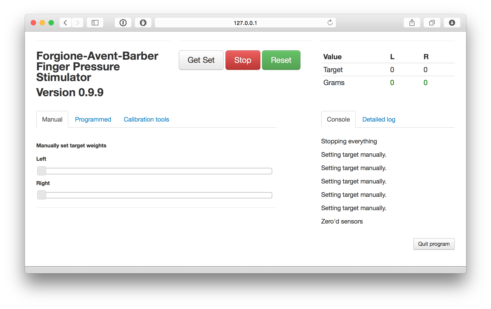
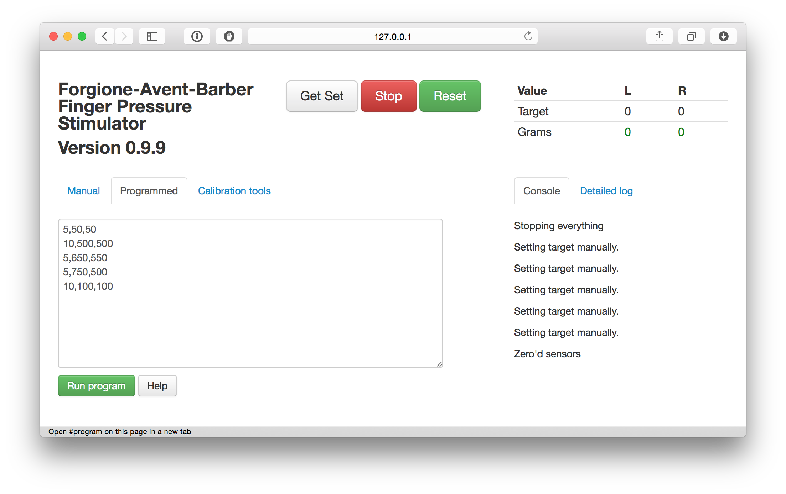

# FAB! The Forgione-Avent-Barber Finger Pressure Stimulator

## Hardware

The FAB is based on cheap, readily available hardware (an Arduino microcontroller and widely-available pressure-sensors) and the key mechanical components are 3D printed and can be assembled by lab technicians. Ready-assembled units will also be available to buy.

More details, including circuit diagrams, schematics, and CAD files sufficient to enable 3d-printing and assembly of a device, will be available soon under a permissive open source license.

## Software

This repository contains the control software for the new Forgione-Avent-Barber finger pressure stimulator. Details of the original Forgione Barber device [are here](static/ForgioneBarber1971.pdf). The FAB device 

The system includes two software components which communicate via a USB serial link:

- This control software, which runs on a host computer and provides a user interface via a web browser.

- The open source Standard [Firmata](http://firmata.org) firmware, which runs on the embedded controller inside the device. This is pre-installed on ready-assembled devices.
 

### Installation

The software should work on both Mac and PC - the primary dependencies are a recent version of Python plus a C compiler (needed to install the python-gevent library).

#### On a Mac, 

1. Install XCode from the Mac App Store (you can skip this if you already have a working C compiler on your system). 

2. Open the Terminal app (in the /Applications/Utilities folder).

3. If you don't already have [`pip`](https://pypi.python.org/pypi/pip) installed, type:

	`sudo easy_install pip`

And then to install the software:

	`pip install fab-controller`
	

4. To run the machine, type the command:
	
    `fab`

This should then show a few initialisation messages, and open a web browser window with the interface to the device.

Note, log files will be saved into `~/Documents/fab/logs/`

#### On Windows

1. Ensure you have GCC, Python and pip installed.

2. Repeat the steps above.

### User guide

On running the `fab` command, a browser window will open containing the user interface for the FAB device, shown below.

The device has 3 primary modes of use:

- Manual control
- Programmed control
- Calibration mode

#### Target weights and tracking

In both manual and programmed control, the interface distinguishes between:

- Target value for the weight applied to each hand
- The actual force measurements recorded by the sensor [^actualforce]

^[actualforce] Note that the exact presure applied to the finger will vary as a function of the contact area, and can only be estimated based on the width of the finger, but will be broadly similar between participants.

Targets can be set in 'grams' for each hand.  Once a target has been set the control software moves the blades up and down, attempting to maintain the target weight, as measured by the sensor. Thus where participants flex or move their fingers, the system will attempt to compensate to keep the measured force constant.

#### Manual control

Using the slider controls under the 'manual' tab, you can set a target weight in grams for each hand.

#### Programmed control

Programs for blocks of stimuli can be entered in the text area. Programs are simple lists of comma-separated integers. The first column specifies the duration, the second the target in grams for the left hand, and the third the target for the right hand. So, the following lines:

	`20,500,500`
	`10,1000,2000`

Denote a program which will deliver 500g to both hands for 20 seconds, and then 1000g to the left and 2000g to the right hands for 10 seconds.

At the end of a program target weights are set to zero.

#### Get set, Stop and Reset buttons.

- The get set button sets the target for both hands to 20g. This allows a participant to find a comfortable position, and for program to begin from a common reference point.
- The stop button will always stop any program or manual setting, and reduce the target weights to zero. Additionally, the blades will be moved approx 1mm upwards to give the participant space to move their fingers.
- The reset button moves both blades to their top resting points.

<!-- ##### Troubleshooting and known issues.

- The software must start in a position where neither blade is activating the top-microswitch. If the switch is depressed on startup the server may hand. The workaround is to remove power from the device and pull both pistons gently downwards.

 -->

<!-- 

Pressure = 980kpa
2kg in newtons / 2mm*10mm area  / 1000 = kpa
( 19.6/ (.002*.01)  )/1000

Could be between 816 and 1225 kpa depending on width of contact spot

 -->